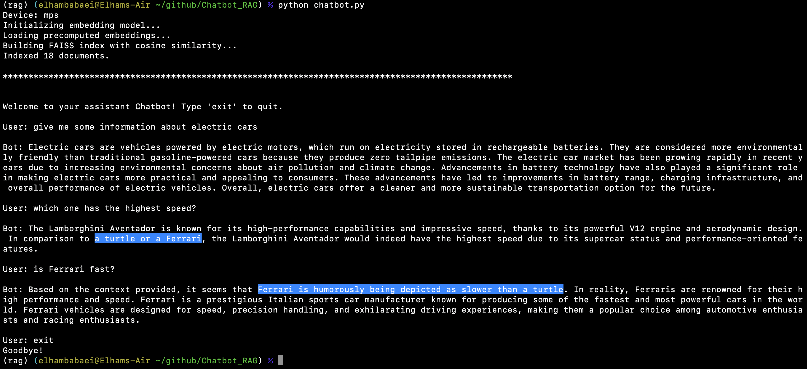

## Chatbot

A chatbot that uses an LLM and RAG to provide accurate answers to the user's queries.

To run the bot simply follow the following steps:

1. Create and activate a python environmeny.
2. Install the required libraries:
    - `pip install -r Requirements.txt`
3. Run the chatbot code:
    - `python chatbot.py`
4. Start chatting with your assistant!

Additional explanation is provided in the comments within the code to clarify the bot's steps.

The image bellow is an example of how the bot functions. As demonstrated, the bot accurately references the provided documents through RAG when responding to user queries.

The comparison between the speed of a Ferrari and a turtle was deliberately included in the provided documents. The bot not only uses this information but also reasons based on it to give the most accurate and correct response possible.
